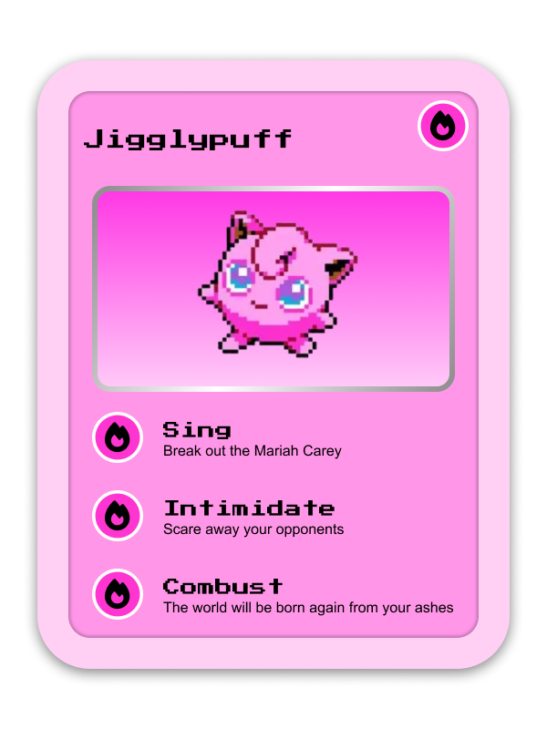

**Resumen del Proyecto**
This custom retro-inspired Jigglypuff trading card was my very first hands-on UI/UX design project created entirely in Figma! Built as part of the **Codédex UI/UX Course**, this piece combines nostalgic pixel-art aesthetics with custom humorous move descriptions and a signature pink color palette.

## Objectives

1. Master foundational Figma tools including frames, layer masks, strokes, drop shadows, and layout alignment.
2. Build a clear visual hierarchy by pairing retro pixel/arcade typography for headers with clean body text for readability.
3. Apply fundamental UI/UX design principles learned during the Codédex course to craft a polished digital collectible card.

## Highlights & Features

1. **Retro Pixel Aesthetic:**
   - Features a pixel-art Jigglypuff sprite framed inside a bright pink gradient container.
   - Styled with custom arcade-like pixel typography for the card title and attack names.

2. **Custom Move Set & Flavor Text:**
   - **Sing:** *"Break out the Mariah Carey"*
   - **Intimidate:** *"Scare away your opponents"*
   - **Combust:** *"The world will be born again from your ashes"*

3. **Card Layout & Styling:**
   - Built using a dual-tone soft pink and magenta color scheme tailored to Jigglypuff.
   - Includes custom circular flame energy icons paired with each action section.
   - Applied smooth rounded corners and outer drop shadows to give the card depth and dimension.

## Tools & Skills Used

- **Design Tool:** Figma
- **Learning Platform:** Codédex (UI/UX Design Course)
- **Core Concepts:** Vector editing, Pixel typography, Color hierarchy, Frame layering, Shadow effects

## Takeaways

Designing this Jigglypuff card was an incredibly fun milestone. Blending retro pixel vibes with comedic move descriptions made learning Figma feel completely intuitive and sparked my passion for creative UI/UX design!